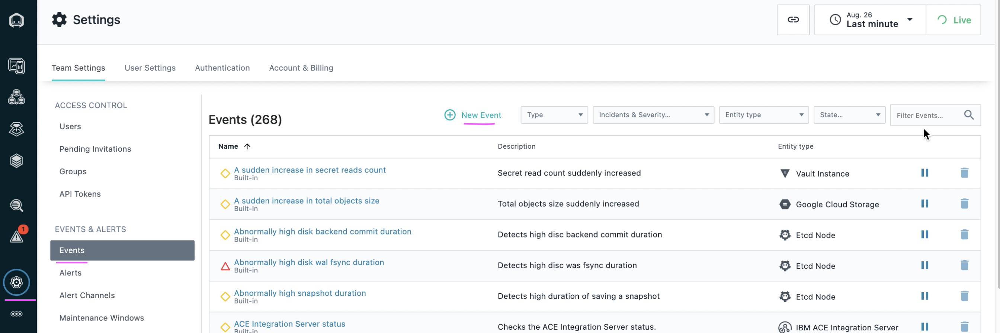
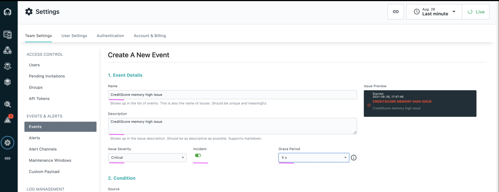
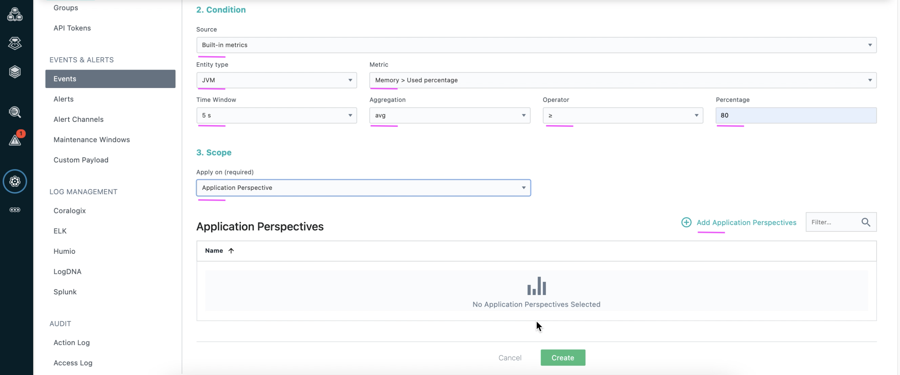
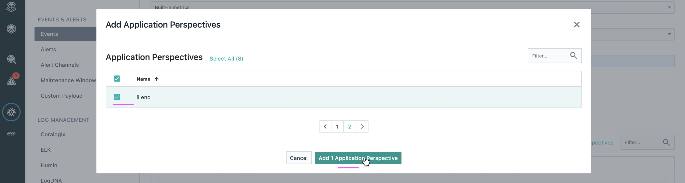
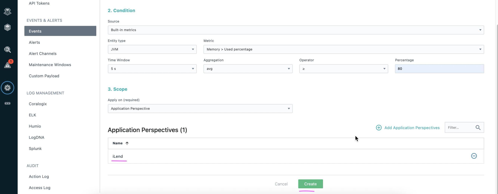
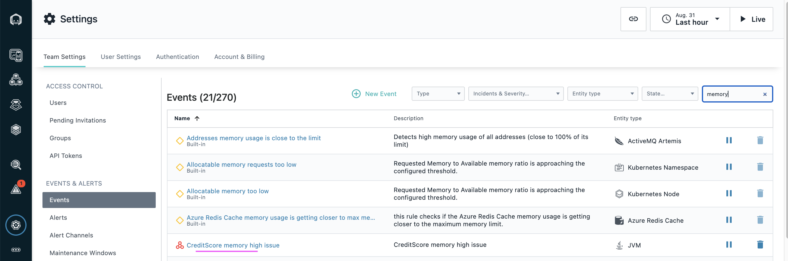

# Create Events in Instana

This article explains about how to create Events in Instana.

## Pre-Requisite

- The `kubernetes based application` is deployed in an Openshift Container Platform or on Kubernetes Cluster.

- `Application Perspective` is already created in Instana for the above deployed application. 

- `Custom Payload` is already created in Instana. 

## Objective

The Objective is to create / configure an Event based on JVM memory usage for a given Application Perspective.

- Application called `iLender` is deployed in `ilend-ns` namespace. 
- Application Perspective called `iLend` is already created and available in the Instana.
- When the `JVM memory usage` is more than `80%` then an event named `CreditScore memory high issue` to be created.

## Steps

1. Choose the menu `Events` under the configuration section. 

1. Click on `New Event` button. 

3. Enter the values for the below fields as shown in the screenshot. 

- Name
- Description
- Issue Severity
- Incident
- Grace Period

4. Enter the values for the below fields as shown in the screenshot. 

- Source
- Entity Type
- Metric
- Time Window
- Aggregation
- Operator
- Percentage
- Apply On

5. Click on `Add Application Perspective` link.

6. Choose the `iLend` from the given list. You can choose any as per your need.

7. Click on `Add 1 Application Perspective` button.

8. Click on the `Create` button to create an event.

9. An event called `CreditScore memory high issue` is created and displayed like the below.

## Next Step

Event is created here. You can create `Alert Channels` and `Alerts` and etc to complete Instana with Watson AIOps Integration.

Prev : [Create Custom Payload in Instana](https://community.ibm.com/community/user/aiops/blogs/jeya-gandhi-rajan-m1/2021/09/08/ins-waiops-4-create-custom-payload-in-instana)

Next : [Create Alert Channels in Instana](https://community.ibm.com/community/user/aiops/blogs/jeya-gandhi-rajan-m1/2021/09/08/ins-waiops-6-create-alert-channels-in-instana)

Home : [Integrating Instana with Watson AIOps](https://community.ibm.com/community/user/aiops/blogs/jeya-gandhi-rajan-m1/2021/09/08/ins-waiops-1-integrating-instana-with-watson-aiops)

#### Released by :

Jeya Gandhi Rajan M
Vijaya Bhaskar R Siddareddi
Vijay Sukthankar (Squad Leader)

Hybrid-Cloud Squad
GSI Labs

#ibmautomation

