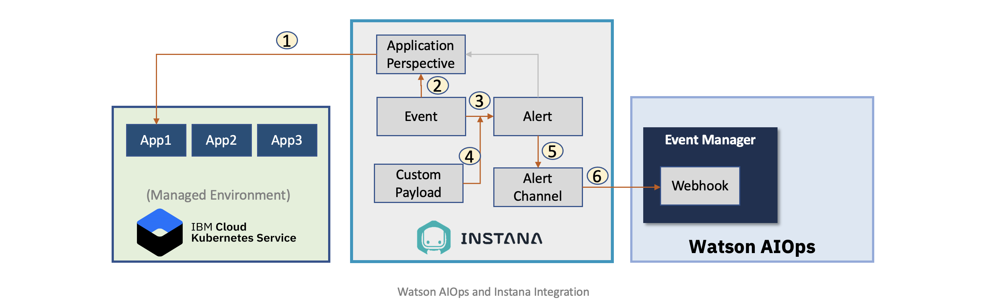

# Integrating Instana with Watson AIOps

This article explains about how to integrate Instana with Watson AIOps.

## Integration flow

1. The managed environment containing kubernetes based application is observed by using Instana. The application perspective created in Instana would show the dashboard.

2. An event is generated when the observations meets the specified critera for the event 

3. Based on the generated event, alert is created  

4. Custom Payload data is also get appended to the alert data.

5. Alert is send to the alert channel

6. Alert Channel would send the alert to the Webhook associated with the Watson AIOps.

## Integration Steps

Integration consists of the below steps. Perform all the steps below to integrate Instana with Watson AIOps.

### 1. Create Instana Webhook in Watson AIOps Event Manager (NOI)

Contains steps to create Webhook in Watson AIOps Event Manager (NOI) Console to receive events from Instana.

[Create Instana Webhook in Watson AIOps Event Manager (NOI)](https://community.ibm.com/community/user/aiops/blogs/jeya-gandhi-rajan-m1/2021/09/08/ins-waiops-2-create-instana-webhook-in-waiops)

### 2. Create Application in Instana

Contains steps to create Application or Application Perspective in Instana for the kubernete based microservices application.

[Create Application in Instana](https://community.ibm.com/community/user/aiops/blogs/jeya-gandhi-rajan-m1/2021/09/08/ins-waiops-3-create-application-in-instana)

### 3. Create Custom Payload in Instana

Contains steps to create Custom Payload in Instana.

This helps the Instana to send additional info along with the alert data to the alert channels.

[Create Custom Payload in Instana](https://community.ibm.com/community/user/aiops/blogs/jeya-gandhi-rajan-m1/2021/09/08/ins-waiops-4-create-custom-payload-in-instana)

### 4. Create Event in Instana

Contains steps to create Event in Instana based on JVM memory usage for a given Application Perspective.

[Create Event in Instana](https://community.ibm.com/community/user/aiops/blogs/jeya-gandhi-rajan-m1/2021/09/08/ins-waiops-5-create-events-in-instana)

### 5. Create Alert Channel in Instana

Contains steps to create Alert Channels in Instana that points to the Webhook in IBM Watson AIOps Event Manager (NOI).

[Create Alert Channel in Instana](https://community.ibm.com/community/user/aiops/blogs/jeya-gandhi-rajan-m1/2021/09/08/ins-waiops-6-create-alert-channels-in-instana)

### 6. Create Alert in Instana

Contains steps to create Alert in Instana about memory high issue pointing to above created alert channel.

[Create Alert in Instana](https://community.ibm.com/community/user/aiops/blogs/jeya-gandhi-rajan-m1/2021/09/08/ins-waiops-7-create-alert-in-instana)

#### Released by :
- Jeya Gandhi Rajan M
- Vijaya Bhaskar R Siddareddi
- Vijay Sukthankar (Squad Leader)

Hybrid-Cloud Squad, GSI Labs

#ibmautomation

